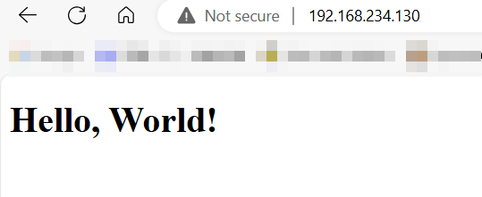

# Lab VM Migrate

## Environment Setup

Install VMware Workstation and create a new VM.

1. Install VMware Workstation 17
2. Create the VM with 4 CPUs, 8G RAM and 60G disk.

## OS Installation

Install Windows Server OS on the VM.

1. Install Windows Server 2016
2. Enable remote desktop

## Application Deployment

Deploy a “Hello World” web application on the Windows Server.

1. Install IIS server on VM
2. Create a "Hello World" html file

## Migration Assessment

Use Azure Migrate to perform an assessment of the VM for migration readiness.

1. Install Azure Migrate Appliance on the VM
2. Config Azure Migrate Appliance Configuration Manager
3. Discovery and assessment

Business Case -  [cst8913.xlsx](cst8913.xlsx)  Assessment Report -  [cst8913assesment.xlsx](cst8913assesment.xlsx) 

## VM Migration Execution

Migrate the VM to Azure using Azure Migrate tools.

1. Clone the VM as the replication server
2. Install agent on the main VM
3. I CAN'T FINISH THE REPLICATION OPERATION ON AZURE. IT STUCK AND GET ERROR WHEN I WAITING FOR UPLOAD IT.

I DID NOTHING BUT IT CARSH. It has wasted me too much of time and i give up.

