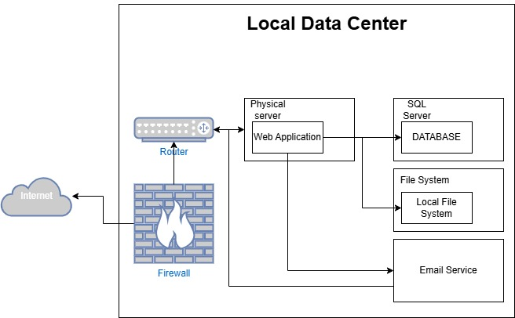

# Lab3

### On-Premises Solution Design

Here is current on-premises architecture for the mid-sized retail company:

- Web application
  - Host on physical servers.
  - Monolithic architecture.
  - Handle all the operation and business logic.
- Backend database
  - Use SQL Server.
  - Host on local servers.
  - Store all the application's data.
- File storage
  - Use local file system.
  - Store all the assets and other files.
- Email services
  - Used for client notification.
  - Integrate with the web application to send emails.
- Networking
  - Company-operated routers and firewalls.
  - Manage internal and external network traffic and prevent malicious cyber attacks.

To migrate this on-premises solution to cloud, these components should be migrate: 

- Web application to PaaS such as Azure App Service.
- Backend database to PaaS such as Azure SQL Database.
- File storage to PaaS such as Azure Blob Storage.
- Networking to IaaS such as Azure Virtual Network.
- Email services to SaaS such as SendGrid and Microsoft 365.

### Migration Strategies

Migration strategy and plan:
- Web application to PaaS
  - Migration strategy: Refactor
  - Steps:
    1. Evaluate current application architecture: Determine which parts need to be modified to fit the PaaS environment.
    2. Choose a PaaS platform: For example, Azure App Service or AWS Elastic Beanstalk.
    3. Refactor application: Modify the code to fit the requirements of the PaaS platform.
    4. Test and validate: Perform thorough testing in the PaaS environment.
    5. Deploy to PaaS: Deploy the application to the selected PaaS platform.
- Database to PaaS
  - Migration strategy: Rehost or Refactor
  - Steps:
    1. Evaluate database needs: Determine whether need to refactor the database to suit the PaaS platform. 
    2. Choose a migration tool: Use Azure Database Migration Service or AWS Database Migration Service.
    3. Migrate database: Migrate the database to the selected platform.
    4. Test and validate: Ensure data integrity and performance.
    5. Optimize and tune: Optimize performance as needed.
- File storage to PaaS
  - Migration strategy: Rehost
  - Steps:
    1. Evaluate current file storage needs: Determine the size and access frequency of file storage.
    2. Choose a storage service: For example, Azure Blob Storage or Amazon S3.
    3. Migrate files: Use tools such as Azure Storage Explorer or AWS S3 Transfer to migrate files to cloud storage.
    4. Configure access permissions: Set appropriate access controls and permissions.
    5. Test and verify: Ensure that files can be accessed and used correctly.
- Network to Cloud Native Network
  - Migration strategy: Rehost
  - Steps:
    1. Design cloud network architecture: Use Azure Virtual Network or Amazon VPC.
    2. Configure virtual network: Set up subnets, routing tables, and network security groups.
    3. Migrate network device configuration: Migrate local router and firewall configurations to the cloud.
    4. Test and verify: Ensure network connectivity and security.
- Email Service to SaaS
  - Migration Strategy: Rehost
  - Steps:
    1. Choose an email service: For example, SendGrid or Microsoft 365.
    2. Configure the email service: Set up the domain name and email templates.
    3. Migrate existing email configuration: Migrate existing email settings and contacts to the new service.
    4. Test and validate: Ensure that email sending and receiving are working properly.

Hybrid approach for migration:
For example, migrating a web application to PaaS while initially keeping the database on IaaS.
These are steps:

1. Web application migration to PaaS:
   - Follow the steps for web application migration above.
2. Database migration to IaaS:
   - Follow the steps for database migration above, but choose IaaS as the target platform.
3. Integrate and test:
   - Ensure that the connection between the web application and the database is working properly.
   - Perform thorough testing to ensure the overall performance and stability of the system.
4. Gradually optimize:
   - Gradually migrate the database to PaaS as needed to achieve greater automation and management efficiency.