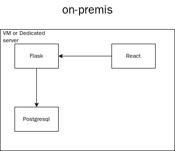
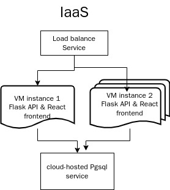
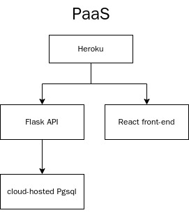

# Lab2

## Deploy on-premise



In a on-premise architecture, the entire application runs on one or more servers, and all components (Flask web server, React frontend, Postgresql database) run on local hardware. 

##### Deployment steps

1. Set up the Flask application: Install the Python environment on the local server and run the Flask application.

2. Set up the React front-end: Install Node.js and related dependencies, and use 

   ```
   npm start
   ```

   to start the service.

3. Install and configure the Postgresql database on the local server and ensure the connection between the flask backend and the database.

## Deploy on IaaS



When using IaaS deployment, developers still need to manage servers, operating systems, and databases.

##### Cloud component selection

- Compute resources: Provide virtual machines for Flask server and React front end.
- Storage and database: Provide cloud-hosted Postgresql database services.
- Load balancing: Balance request between multiple instances.

##### Deployment steps

1. Create virtual machines: Use the IaaS platform to create virtual machine instances such as AWS or GCP, choose a OS for VM and install Flask backend and React front end.
2. Database deployment: Use cloud-hosted database service to deploy Postgresql database and connect to the backend.
3. Set up load balancing: Configure the load balancer to evenly distribute traffic among multiple Flask and React instances.

## Deploy on PaaS



Developers don't need to manage operating systems, databases, or servers, and can focus on code and application logic.

##### Cloud component selection

- Application hosting platform (such as Heroku, Railway.app): used to host Flask backend and React frontend, automatically handle server management and scaling.
- Managed database (such as Google Cloud database): Provides a Postgresql database in the cloud, without the need to manage instances.

##### Deployment steps

1. Deploy the backend and frontend: Use PaaS services (such as Heroku) to push Flask and React applications to the hosting platform. The platform automatically configures the operating environment for the application.
2. Use a managed database: Use GCP Postgresql or similar cloud services to configure the database and connect it to the backend application.
3. Automatic scaling and management: The PaaS platform automatically handles infrastructure tasks such as application scaling, load balancing, and operating system upgrades.