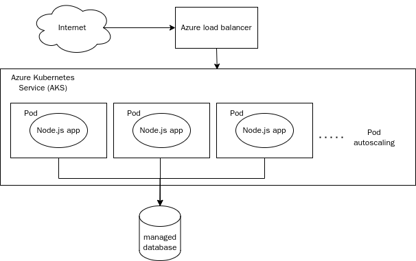

# CST8913 Cloud Migration Lab4 V2

## Target architecture diagram

## Target architecture description

The target architecture includes the following components:

- Azure Kubernetes Service (AKS): used to host containerized web servers. By using the container orchestration function of Kubernetes, the scalability and high availability of applications are achieved.
- Managed SQL Database Service: used to host SQL Server databases, providing high availability and automatic backup functions.

Architecture advantages:

- Scalability: Through the automatic expansion function of Kubernetes, the number of instances of the web server is dynamically adjusted according to traffic demand.
- High availability: The self-healing function provided by Kubernetes and the high availability configuration of Azure SQL Database ensure that the application can recover quickly in the event of a failure.
- Simplified management: Using managed services reduces the complexity of infrastructure management and focuses on application development and optimization.

## Migration steps

1. Containerize the web application
  1. Create a container image:
    - Create a Dockerfile on the WebServerVM that defines the environment and dependencies for the Node.js application.
    - Build the Docker image and push it to the Azure Container Registry (ACR).
  2. Configure the container registry: Ensure that the ACR is configured correctly and that the AKS cluster can access the container image in the ACR.
2. Migrate the database to the managed SQL service
  1. Prepare for migration:
    - Back up the existing SQL Server database on the SQLVM.
    - Create a new managed SQL database instance on Azure.
  2. Perform the migration:
    - Migrate the data from the SQLVM to the new Azure SQL database using Azure Database Migration Service (DMS).
    - Update the application's database connection string to point to the new managed SQL database.
3. Configure the Kubernetes cluster for high availability
  1. Create an AKS cluster: Create a new AKS cluster in the Azure portal and configure the node pool and network settings.
  2. Deploy the web application:
    - Create a Kubernetes deployment file that defines the deployment and service configuration for the application.
    - Use the kubectl tool to deploy the application to the AKS cluster.
  3. Configure autoscaling: Set up horizontal pod autoscaling (HPA) to automatically adjust the number of pods based on load to ensure scalability of the application.
  4. Set up traffic management: Configure traffic manager in the Azure portal to ensure cross-region traffic distribution and failover.
4. Downtime management
  - Plan downtime window: During the migration process, plan downtime of no more than 6 hours to ensure that it is carried out during low traffic periods.
  - Notify users: Notify users of planned downtime and expected impact in advance to reduce the impact on users.