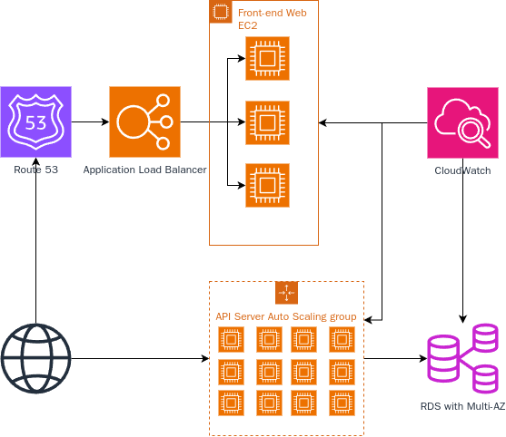

# CST8913 Cloud Migration Lab5

## Target Architecture Overview

This architecture aims to migrate the current 3-tier eCommerce application (WebAppVM, APIVM, DBVM) from the on-premises environment to AWS and use AWS services for high availability, scalability, and disaster recovery.

**AWS target architecture**

- Front-end Web Server:
  - Service: EC2 instances behind AWS Application Load Balancer (ALB)
  - Function: Host static web content on EC2 instances using Apache/Nginx.
  - Scalability and Availability: ALB distributes incoming traffic to multiple EC2 instances to handle different loads.
  - Auto Scaling: Automatically scales based on demand to maintain performance.
- Backend API Server:
  - Service: EC2 instances using Auto Scaling Group (ASG)
  - Function: Serve API requests (such as Node.js, Java, or .NET).
  - Scalability and Availability: ASG dynamically adjusts the number of EC2 instances based on traffic to ensure timely response at the API layer.
- SQL Database:
  - Service: Use Amazon RDS (Relational Database Service) with Multi-AZ deployment enabled for increased availability and fault recovery.
  - Function: Hosts a relational database with high availability and failover capabilities.
  - Data consistency: Multi-AZ deployment ensures data consistency and synchronization between the primary database and the standby instances.

**Solution Diagram**

**The target architecture diagram shows**

ALB distributes traffic to the front-end EC2 instances.
Autoscaling groups manage EC2 instances for the API servers.
RDS Multi-AZ deployments are used for the database.
CloudWatch is used for monitoring and Route 53 for DNS resolution.

## Addresses scalability, availability, and disaster recovery

**Scalability:**

- ALB ensures that traffic to the front-end web servers is distributed across multiple EC2 instances, improving scalability.
- Auto Scaling Groups (ASGs) dynamically increase or decrease back-end API server instances based on preset metrics (such as CPU utilization).
- RDS automatically scales read and write operations and supports read replicas for horizontal scaling.

**Availability:**

- ALB and Auto Scaling Groups ensure high availability of the front-end and API servers, with instances distributed across multiple availability zones.
- RDS Multi-AZ deployment provides automatic failover between master and slave databases to ensure continuous availability of the database.

**Disaster Recovery:**

- RDS Multi-AZ configuration ensures failover across availability zones in the event of a disaster, reducing downtime.
- Configure EC2 backups (AMIs) and database snapshots to restore the entire environment when needed.
- Route 53 DNS Failover can smoothly redirect traffic in the event of a failure.

## Migration Process Breakdown

### Phase 1: Before Migration Planning

1. Record the configuration of WebAppVM, APIVM, and DBVM in on-premises environment(such as operating system, web server, and database details).
2. Ensure that the AWS account is configured with the required permissions to use EC2, ALB, RDS, Auto Scaling, CloudWatch, and Route 53.
3. Configure Virtual Private Cloud (VPC), subnets (across multiple availability zones), security groups, and routing tables.
4. Take a full backup of the database and application files.

### Phase 2: Migrate Web and API Layers

1. Launch EC2 instances to host the front-end web servers (Apache/Nginx) and back-end API servers (Node.js/Java/.NET).
2. Create an Application Load Balancer (ALB) and associate EC2 instances for traffic distribution.
3. Configure Auto Scaling Groups (ASGs) to automatically scale API server instances based on metrics such as CPU utilization.
4. Test traffic distribution through ALB, generate simulated load using load testing tools, and observe the scaling behavior of the API layer.

### Phase 3: Migrate Database

1. Set up the database (MySQL, PostgreSQL, or SQL Server) using Amazon RDS and enable multi-AZ deployment.
2. Migrate database: 
   - Migrate the local database to RDS using AWS Database Migration Service (DMS) or native import and export methods (such as mysqldump for MySQL or SQL Server management tools).
   - Enable data synchronization during migration to ensure data consistency.
3. Simulate failover scenarios to ensure that the multi-AZ configuration works properly.

### Phase 4: Cutover and Go-Live

1. Cutover: 
   - Perform final data synchronization during a time window with low traffic and switch traffic to the environment on AWS.
   - Update Route 53 DNS to point to the ALB on AWS to complete the front-end traffic switch.
2. Test: 
   - Before performing the final DNS switch, perform a data consistency check to ensure that the AWS RDS data is fully synchronized with the local database. If any discrepancies are found, stop the migration immediately and fix the issues.
   - Use tools (such as checksum comparison tools) or manually to check the integrity and consistency of critical data.
3. Use CloudWatch to monitor performance metrics, errors, and scaling activities for EC2, RDS, and Auto Scaling.
4. Rollback strategies:
   - If find that AWS RDS has data corruption, poor performance, or other problems after switching to AWS, the administrator should immediately stop the user traffic switch.
   - Switch Route 53 DNS back to the local environment to ensure that users continue to access the original local database and API services.
   - If the data on AWS RDS is damaged or lost, restore it to the state before the problem occurred through the previous local database snapshot.
   - Stop the two-way data synchronization between AWS and the local database to ensure that the local database runs completely independently.

### Phase 5: After Migration Optimization

1. Optimization: Optimize instance types, database configurations, and scaling strategies by analyzing logs and usage patterns.
2. Backup: Configure regular RDS backups and Amazon S3 for application backups.

## How to minimize downtime

To ensure that downtime does not exceed 2 hours, the following strategies will be adopted:

- The environment is configured on AWS while the on-premises system remains running to ensure that the production system is not affected during the migration.
- Database replication: AWS DMS is used for continuous data replication to synchronize the local database with RDS to reduce the final data synchronization time.
- DNS switch timing: DNS switch is performed only after all preparations are completed to ensure that downtime is limited to the switch operation.

## SQL Database Data Consistency Strategy

Data consistency is ensured by:

- Using Amazon RDS Multi-AZ deployment to ensure synchronous replication between the master and slave databases.
- Perform data consistency checks before and after migration to ensure that there is no data loss or corruption.
- Using the continuous replication feature of AWS DMS during migration to ensure that the databases remain in sync when switching.

