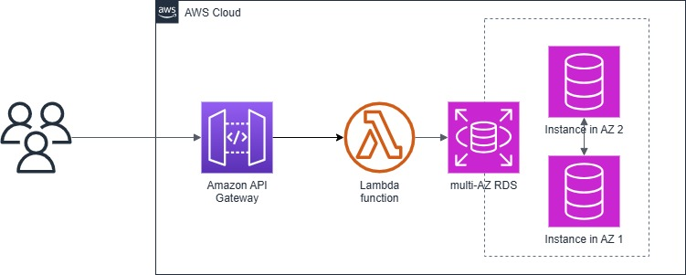

# CST8913 Cloud Migration Lab4 v3

### Target architecture diagram

### Target architecture description

The target architecture migrates existing VM-based applications to the AWS Cloud for high availability and scalability.

**Serverless computing**
AWS Lambda will be used to refactor API-based applications hosted by WebServerVM. Lambda functions provide the following advantages.

- Automatic scaling: Lambda functions can automatically scale according to the number of requests without manual intervention. This means that during peak hours, Lambda can handle more requests and reduce resource usage during off-peak hours, thereby optimizing costs.
- No server management required: Developers do not need to manage the underlying server infrastructure, AWS is responsible for all server maintenance, patching, and expansion. This greatly reduces the operational burden and allows development teams to focus on business logic.
- Event-driven architecture: Lambda functions can respond to various event triggers, such as HTTP requests, database changes, file uploads, etc. This makes applications more flexible and responsive.

**Database high availability**
Amazon RDS will be used to host MySQL databases and enable multi-AZ replication.

- High availability: Multi-AZ replication ensures that the database can automatically fail over to another availability zone when a failure occurs in one availability zone. This minimizes downtime and ensures the continuity of applications.
- Automatic backup and recovery: RDS provides an automatic backup function that can back up the database regularly and restore it when needed. This ensures the security and recoverability of the data.
- Performance optimization: RDS provides a variety of instance types and storage options, which can be optimized according to the needs of the application. In addition, RDS also supports read-write separation, improving read performance through read-only replicas.

**Scalability and elasticity**

- Elastic Load Balancing: Use Amazon API Gateway as the entry point to automatically distribute traffic to different Lambda functions. API Gateway provides traffic management, caching, and monitoring capabilities to ensure high performance and high availability of APIs.
- Monitoring and logging: Use Amazon CloudWatch to monitor the performance metrics of Lambda functions and RDS instances. Configure alarms and notifications so that you can respond in time when anomalies occur. Use AWS CloudTrail to record API calls for security audits and compliance checks.

### Migration steps

1. Refactor the application to use serverless functions:
   - Code analysis: Analyze the existing WebServerVM application code and identify the parts that can be migrated to AWS Lambda.
   - Write Lambda functions: Refactor the existing API endpoints into Lambda functions. Ensure that each functional module can run independently in a serverless environment.
   - Configure API Gateway: Use API Gateway to configure API endpoints for integration with Lambda functions. Set up appropriate routing, authentication, and authorization mechanisms.
   - Test and verify: Perform unit tests and integration tests to ensure that the integration of Lambda functions and API Gateway works properly. Simulate various usage scenarios to ensure functional integrity and performance.
2. Migrate the database to Amazon RDS using multi-AZ replication:
   - Create RDS instance: Create a new Amazon RDS instance in the AWS console and enable multi-AZ replication. Select the appropriate instance type and storage configuration to meet performance requirements.
   - Data migration: Use AWS Database Migration Service (DMS) to migrate the existing MySQL database from SQLVM to the new RDS instance. Configure the source and target database connections and set up the migration task.
   - Verify data integrity: After the migration is complete, perform data verification to ensure that all data has been successfully migrated and is consistent. Perform data integrity checks and performance tests.
3. Configure failover and redundancy to minimize downtime:
   - Automatic failover settings: Configure automatic failover settings for RDS instances to ensure that they automatically switch to the standby instance when the primary instance fails. Test the failover mechanism to ensure its reliability.
   - Monitoring and alarms: Set up CloudWatch alarms and notifications to respond in time when failures occur. Monitor key performance indicators and system health.
   - Failover drills: Perform failover drills regularly to test the system's responsiveness in failure situations. Ensure that the team is familiar with the failover process and can quickly restore service.